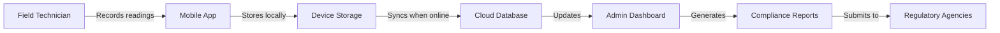

# Thermal Compliance Monitoring System

**Enterprise-grade digital compliance solution for thermal oxidizer operations**

[](https://github.com/BryceMonte/thermal-compliance-app/actions)
[](https://flutter.dev/)
[](https://firebase.google.com/)
[](https://nextjs.org/)
[](LICENSE)

---

## Overview

The Thermal Compliance Monitoring System is an enterprise software solution designed to digitize and streamline regulatory compliance operations for thermal oxidizer facilities in the oil & gas, petrochemical, and industrial manufacturing sectors.

### Problem Statement

Industrial facilities operating thermal oxidizers face significant challenges with regulatory compliance:

- **Paper-based logging** creates inefficiencies, data quality issues, and audit risks
- **Manual data transcription** introduces human error in critical environmental reporting
- **Disconnected field operations** lead to delayed visibility into compliance status
- **Regulatory reporting** requires hours of manual Excel compilation from paper logs
- **Remote facility locations** often lack reliable network connectivity

### Solution

This system provides a comprehensive digital compliance platform consisting of:

**Mobile Application** - Cross-platform field data collection application built with Flutter, designed for offline operation in remote locations. Features dynamic form generation, real-time validation, and automated synchronization.

**Admin Dashboard** - Web-based management console built with Next.js providing real-time monitoring, template management, user administration, and automated Excel report generation for regulatory submissions.

**Cloud Infrastructure** - Firebase backend providing authentication, real-time data synchronization, and secure multi-tenant data storage with role-based access control.

### Business Value

- Eliminates paper-based logging and manual data entry workflows
- Reduces regulatory reporting time through automated Excel generation
- Improves data accuracy with point-of-entry validation
- Provides real-time visibility into compliance status across all facilities
- Supports offline operation for remote field locations
- Maintains complete audit trails for regulatory compliance

---

## Key Features

### Mobile Application
- Cross-platform deployment (iOS, Android, Web)
- Offline-first architecture with local data persistence
- Dynamic form generation based on facility-specific requirements
- Real-time data validation and error prevention
- OCR scanning for paper log digitization
- Automated data synchronization when connectivity is available

### Admin Dashboard
- Real-time compliance monitoring across all facilities
- Drag-and-drop template builder for custom compliance forms
- Automated Excel report generation for regulatory submissions
- Role-based access control and user management
- Complete audit logging of all data modifications
- Advanced analytics and trend analysis

### Operational Workflow



**Process Flow:**
1. Field technicians access assigned jobs via mobile application
2. Data collection performed using dynamic forms with validation
3. Readings stored locally and synced automatically when connectivity available
4. Management reviews compliance status in real-time via dashboard
5. Regulatory reports generated with one-click Excel export

---

## Screenshots

### Job Selection Dashboard

*Mobile interface showing job assignments and status tracking*

---

## Technology Stack

### Mobile & Web Platform
- **Flutter 3.32.7** - Cross-platform mobile and web framework
- **Dart** - Application programming language
- **Riverpod** - State management and dependency injection
- **Hive** - Local NoSQL database for offline storage
- **Google ML Kit** - OCR for paper log digitization
- **Go Router** - Declarative navigation

### Admin Dashboard
- **Next.js 15** - React-based web framework
- **React 19** - UI component library
- **TypeScript** - Type-safe development
- **Tailwind CSS** - Utility-first CSS framework
- **Radix UI** - Accessible component primitives
- **ExcelJS** - Programmatic Excel report generation

### Backend & Infrastructure
- **Firebase Firestore** - Real-time NoSQL cloud database
- **Firebase Authentication** - User authentication and session management
- **Firebase Hosting** - Static web hosting
- **Firebase Security Rules** - Data access control

### Development & Operations
- **GitHub Actions** - CI/CD pipeline
- **Docker** - Containerization for development
- **Firebase Emulators** - Local development environment
- **Flutter Test** - Unit and integration testing

---

## Installation & Setup

### Prerequisites
- Flutter SDK 3.32.7 or later
- Node.js 24.4.0 or later
- Firebase CLI
- Git

### Mobile Application

```bash
# Clone repository
git clone https://github.com/yourusername/thermal-compliance-app.git
cd thermal-compliance-app

# Install dependencies
flutter pub get

# Run on web
flutter run -d chrome

# Run on mobile (requires device or emulator)
flutter run
```

### Admin Dashboard

```bash
# Navigate to dashboard directory
cd admin-dashboard

# Install dependencies
npm install

# Start development server
npm run dev

# Access dashboard at http://localhost:3000
```

### Firebase Configuration

```bash
# Copy environment template
cp .env.example .env

# Configure Firebase credentials in .env
# FIREBASE_API_KEY=your_api_key
# FIREBASE_PROJECT_ID=your_project_id
# FIREBASE_AUTH_DOMAIN=your_auth_domain
```

---

## Testing

```bash
# Run Flutter unit tests
flutter test

# Run Flutter integration tests
flutter test integration_test/

# Run admin dashboard tests
cd admin-dashboard
npm test
```

---

## Documentation

- [Architecture Overview](docs/architecture.md) - System design and technical architecture
- [API Reference](docs/api.md) - Backend API documentation
- [Contributing Guidelines](docs/contributing.md) - Development workflow and standards

---

## Development Roadmap

### Current Release (v1.0)
- Cross-platform mobile application
- Firebase authentication and data synchronization
- Dynamic form generation system
- Automated Excel report generation
- Web-based admin dashboard
- Role-based access control

### Upcoming (v1.1)
- Enhanced OCR accuracy with custom model training
- Visual template builder with drag-and-drop interface
- Advanced analytics and trend analysis
- Batch import functionality

### Future Releases
- Push notification system for critical alerts
- Cloud Functions for server-side data processing
- Multi-tenant architecture for enterprise deployment
- RESTful API for third-party integrations
- Mobile app offline data compression
- Advanced reporting with custom visualizations

---

## License

This project is licensed under the MIT License - see the [LICENSE](LICENSE) file for details.

---

## Contact

**Bryce Montemayor**

Email: [Bryceman0829@yahoo.com](mailto:Bryceman0829@yahoo.com)  
LinkedIn: [linkedin.com/in/bryce-montemayor-8a9132124](https://www.linkedin.com/in/bryce-montemayor-8a9132124)

---

*Enterprise compliance monitoring solution for industrial operations*
