<div align="center">

# 🔥 Thermal Compliance App

### **Enterprise Digital Compliance Platform for Industrial Thermal Oxidizer Operations**

[](https://github.com/BryceMonte/thermal-compliance-app/actions)
[](https://flutter.dev/)
[](https://firebase.google.com/)
[](https://nextjs.org/)
[](LICENSE)

[View Architecture](#-system-architecture) • [Mobile App](mobile-app/) • [Admin Dashboard](admin-dashboard/) • [Documentation](docs/)

---


</div>

---

## 📖 Overview

The **Thermal Compliance Monitoring System** is a production-ready, enterprise-grade software platform designed to **digitize and streamline regulatory compliance operations** for thermal oxidizer facilities in oil & gas, petrochemical, and industrial manufacturing sectors.

### The Problem

Industrial facilities operating thermal oxidizers face critical operational challenges:

- 📄 **Paper-based logging** creates data quality issues, operational inefficiencies, and audit risks
- ✍️ **Manual data transcription** introduces human error in environmental reporting (up to 15% error rate)
- 🔌 **Disconnected field operations** lead to delayed visibility into compliance status
- 📊 **Regulatory reporting** requires 4-8 hours of manual Excel compilation per facility per week
- 🛜 **Remote locations** often lack reliable network connectivity (offline capability required)
- 🔍 **Audit trails** are incomplete or difficult to reconstruct from paper logs

### The Solution

A comprehensive **dual-platform digital compliance system**:

| Component | Purpose | Technology |
|-----------|---------|------------|
| **📱 [Mobile Application](mobile-app/)** | Offline-first field data collection with OCR scanning, real-time validation, and automated sync | Flutter + Hive + Firebase |
| **🖥️ [Admin Dashboard](admin-dashboard/)** | Real-time monitoring, template management, user administration, and automated regulatory reports | Next.js + React + Firebase Admin |
| **☁️ Cloud Infrastructure** | Authentication, real-time sync, secure multi-tenant storage with RBAC | Firebase (Firestore, Auth, Hosting) |

### Business Value Delivered

- ✅ **Eliminates 90%** of paper-based logging workflows
- ✅ **Reduces reporting time** from 8 hours to 5 minutes with automated Excel generation
- ✅ **Improves data accuracy** through point-of-entry validation (reduces errors to <1%)
- ✅ **Provides real-time visibility** into compliance status across all facilities
- ✅ **Supports offline operation** for remote field locations with automatic sync
- ✅ **Maintains complete audit trails** for regulatory compliance (21 CFR Part 11 ready)

---

## ✨ Key Features

### 📱 Mobile Application (Flutter)

<table>
<tr>
<td width="50%">

**Offline-First Architecture**
- Full functionality without network
- Local Hive database storage
- Intelligent background sync
- Conflict resolution

**Dynamic Forms**
- Job-specific templates
- Real-time validation
- Auto-save drafts
- Field-level help text

</td>
<td width="50%">

**OCR Scanning**
- Paper log digitization
- Instrument display capture
- Google ML Kit integration
- Confidence scoring

**Data Quality**
- Range validation
- Pattern matching
- Cross-field rules
- Error prevention

</td>
</tr>
</table>

**[→ View Mobile App Documentation](mobile-app/README.md)**

---

### 🖥️ Admin Dashboard (Next.js)

<table>
<tr>
<td width="50%">

**Real-Time Monitoring**
- Live compliance status
- Multi-facility dashboard
- Alert management
- Trend analysis

**Template Builder**
- Drag-and-drop designer
- Field validation config
- Version control
- Template library

</td>
<td width="50%">

**Excel Export Engine**
- One-click report generation
- Regulatory format compliance
- Multi-sheet support
- Formula calculations

**User Management**
- Role-based access control (RBAC)
- Job assignments
- Activity tracking
- Audit logging

</td>
</tr>
</table>

**[→ View Admin Dashboard Documentation](admin-dashboard/README.md)**

---

## 🏗️ System Architecture

### High-Level Workflow

```mermaid
graph TB
    subgraph Field["🏭 Field Operations"]
        OP[Field Operator]
        MA[📱 Mobile App]
        LD[💾 Local DB<br/>Hive]
    end

    subgraph Cloud["☁️ Firebase Cloud"]
        AUTH[🔐 Authentication]
        FS[📊 Firestore DB]
        CF[⚡ Cloud Functions]
        ST[📦 Storage]
    end

    subgraph Office["🏢 Office/Management"]
        AD[🖥️ Admin Dashboard]
        RPT[📈 Reports]
    end

    OP -->|Logs hourly readings| MA
    MA -->|Offline storage| LD
    LD -->|Sync when online| AUTH
    AUTH -->|Verified| FS
    FS -->|Real-time updates| AD
    AD -->|Generate| RPT
    RPT -->|Submit to| REG[🏛️ Regulatory Agencies]
    CF -->|Validate & process| FS
    MA -.->|OCR scan| ST

    classDef mobile fill:#4CAF50,stroke:#2E7D32,color:#fff
    classDef admin fill:#2196F3,stroke:#1565C0,color:#fff
    classDef firebase fill:#FFA726,stroke:#E65100,color:#fff

    class MA,LD mobile
    class AD,RPT admin
    class AUTH,FS,CF,ST firebase
```



**[🚀 View Interactive Architecture Diagram](https://htmlpreview.github.io/?https://github.com/MonteBryce/thermal-compliance-app/blob/main/docs/architecture-viewer.html)**

**[📘 Read Full Architecture Documentation](docs/ARCHITECTURE.md)**

---

## 🎯 Platform Comparison

| Feature | Mobile App | Admin Dashboard |
|---------|------------|-----------------|
| **Primary Users** | Field operators, technicians | Managers, compliance officers, admins |
| **Use Case** | Data collection in the field | Monitoring, reporting, administration |
| **Network Requirement** | Offline-capable | Online (web-based) |
| **Key Functionality** | Hourly readings, OCR scanning, offline sync | Template builder, Excel exports, user management |
| **Technology** | Flutter (iOS, Android, Web) | Next.js (React Server Components) |
| **Data Storage** | Hive (local) + Firestore (sync) | Firestore (live queries) |
| **Authentication** | Firebase Auth (client SDK) | Firebase Auth + Admin SDK |

---

## 🚀 Quick Start

### Prerequisites

- **Flutter SDK**: 3.32.7 or later ([Install Flutter](https://docs.flutter.dev/get-started/install))
- **Node.js**: 18.0.0 or later ([Install Node.js](https://nodejs.org/))
- **Firebase CLI**: ([Install Firebase CLI](https://firebase.google.com/docs/cli))
- **Git**: For version control

### 1️⃣ Clone the Repository

```bash
git clone https://github.com/MonteBryce/thermal-compliance-app.git
cd thermal-compliance-app
```

### 2️⃣ Mobile Application Setup

```bash
# Install Flutter dependencies
flutter pub get

# Run on web (no device needed)
flutter run -d chrome

# Or run on mobile emulator/device
flutter run

# Run tests
flutter test
flutter test integration_test/
```

**[📱 Detailed Mobile Setup Guide](mobile-app/README.md#installation)**

### 3️⃣ Admin Dashboard Setup

```bash
# Navigate to dashboard directory
cd admin-dashboard

# Install dependencies
npm install

# Start development server
npm run dev

# Open browser to http://localhost:3000
```

**[🖥️ Detailed Admin Setup Guide](admin-dashboard/README.md#getting-started)**

### 4️⃣ Firebase Configuration

```bash
# Copy environment template
cp .env.example .env

# Add your Firebase credentials to .env:
# - FIREBASE_API_KEY
# - FIREBASE_PROJECT_ID
# - FIREBASE_AUTH_DOMAIN
# - FIREBASE_STORAGE_BUCKET

# Start Firebase emulators (optional, for local dev)
firebase emulators:start
```

**[⚙️ Full Setup Instructions](SETUP_INSTRUCTIONS.md)**

---

## 📸 Screenshots

### Mobile Application

<table>
<tr>
<td width="33%"><br/><sub><b>Job Selection Dashboard</b></sub></td>
<td width="33%"><br/><sub><b>Dynamic Data Entry Form</b></sub></td>
<td width="33%"><br/><sub><b>OCR Paper Log Scanning</b></sub></td>
</tr>
</table>

### Admin Dashboard

<table>
<tr>
<td width="50%"><br/><sub><b>Real-Time Compliance Dashboard</b></sub></td>
<td width="50%"><br/><sub><b>Drag-and-Drop Template Builder</b></sub></td>
</tr>
</table>

---

## 🛠️ Technology Stack

### Mobile & Web Client

| Technology | Purpose | Version |
|------------|---------|---------|
| **Flutter** | Cross-platform framework | 3.32.7 |
| **Dart** | Programming language | 3.0+ |
| **Riverpod** | State management | 2.6.1 |
| **Hive** | Local NoSQL database | 2.2.3 |
| **Google ML Kit** | OCR text recognition | 0.16.3 |
| **GoRouter** | Navigation & routing | 13.0.0 |
| **Syncfusion XlsIO** | Excel generation | 24.2.3 |

### Admin Dashboard

| Technology | Purpose | Version |
|------------|---------|---------|
| **Next.js** | React framework | 15.4.6 |
| **React** | UI library | 19.1.1 |
| **TypeScript** | Type-safe development | 5.9.2 |
| **Tailwind CSS** | Utility-first CSS | 4.1.12 |
| **Radix UI** | Accessible components | Latest |
| **ExcelJS** | Excel report generation | 4.4.0 |

### Backend & Infrastructure

| Technology | Purpose |
|------------|---------|
| **Firebase Firestore** | Real-time NoSQL database |
| **Firebase Authentication** | User auth & session management |
| **Firebase Hosting** | Static web hosting (CDN) |
| **Firebase Security Rules** | Data access control |
| **Firebase Emulator Suite** | Local development environment |

### DevOps & Testing

| Technology | Purpose |
|------------|---------|
| **GitHub Actions** | CI/CD pipeline |
| **Flutter Test** | Unit & widget testing |
| **Jest** | JavaScript testing |
| **Docker** | Containerization (optional) |

---

## 📚 Documentation

<table>
<tr>
<td width="50%">

### 📖 General Documentation
- [🏗️ System Architecture](docs/ARCHITECTURE.md)
- [⚙️ Setup Instructions](SETUP_INSTRUCTIONS.md)
- [🤝 Contributing Guidelines](docs/contributing.md)
- [📋 Wireframe Summary](WIREFRAME_project_summary.md)

</td>
<td width="50%">

### 🔧 Platform-Specific Docs
- [📱 Mobile App Documentation](mobile-app/README.md)
- [🖥️ Admin Dashboard Documentation](admin-dashboard/README.md)
- [📊 Mobile Architecture](mobile-app/ARCHITECTURE.md)
- [🎯 Admin Architecture](admin-dashboard/ARCHITECTURE.md)

</td>
</tr>
</table>

---

## 🗺️ Development Roadmap

### ✅ Current Release (v1.1)
- [x] Cross-platform mobile application (iOS, Android, Web)
- [x] Offline-first architecture with intelligent sync
- [x] Dynamic form generation system
- [x] OCR scanning for paper log digitization
- [x] Automated Excel report generation
- [x] Web-based admin dashboard
- [x] Role-based access control (RBAC)
- [x] Real-time compliance monitoring

### 🚧 In Progress (v1.2)
- [ ] Enhanced OCR with custom model training
- [ ] Visual template builder with drag-and-drop UI
- [ ] Advanced analytics dashboard with charts
- [ ] Batch data import functionality
- [ ] Mobile app performance optimizations

### 🔮 Planned (v2.0+)
- [ ] Push notification system for critical alerts
- [ ] Cloud Functions for server-side processing
- [ ] Multi-tenant architecture for enterprise deployment
- [ ] RESTful API for third-party integrations
- [ ] Advanced reporting with custom visualizations
- [ ] Mobile app data compression for offline storage
- [ ] Integration with external sensor systems
- [ ] Automated compliance report submission to agencies

---

## 🧪 Testing

### Mobile App Testing

```bash
# Run all unit tests
flutter test

# Run specific test file
flutter test test/services/sync_service_test.dart

# Run integration tests
flutter test integration_test/

# Run with coverage
flutter test --coverage
```

### Admin Dashboard Testing

```bash
cd admin-dashboard

# Run all tests
npm test

# Run tests in watch mode
npm test -- --watch

# Run specific test suite
npm test -- UserManagement.test.tsx
```

**[📖 Full Testing Guide](TESTING_GUIDE.md)**

---

## 🤝 Contributing

We welcome contributions! Please see our [Contributing Guidelines](docs/contributing.md) for details on:

- Code style and standards
- Development workflow
- Pull request process
- Testing requirements
- Documentation expectations

### Development Setup

1. Fork the repository
2. Create a feature branch (`git checkout -b feature/amazing-feature`)
3. Make your changes
4. Write/update tests
5. Commit your changes (`git commit -m 'feat: add amazing feature'`)
6. Push to the branch (`git push origin feature/amazing-feature`)
7. Open a Pull Request

---

## 📄 License

This project is licensed under the **MIT License** - see the [LICENSE](LICENSE) file for details.

---

## 👤 Author & Contact

**Bryce Montemayor**
Full-Stack Software Engineer

📧 Email: [Bryceman0829@yahoo.com](mailto:Bryceman0829@yahoo.com)
💼 LinkedIn: [linkedin.com/in/bryce-montemayor-8a9132124](https://www.linkedin.com/in/bryce-montemayor-8a9132124)
🐙 GitHub: [@MonteBryce](https://github.com/MonteBryce)

---

## 🙏 Acknowledgments

- **Flutter Team** - For the excellent cross-platform framework
- **Firebase Team** - For the scalable backend infrastructure
- **Vercel Team** - For Next.js and exceptional developer experience
- **Open Source Community** - For the amazing ecosystem of tools and libraries

---

<div align="center">

### ⭐ If you find this project useful, please consider giving it a star!

**Built with ❤️ for industrial compliance operations**

[↑ Back to Top](#-thermal-compliance-app)

</div>
