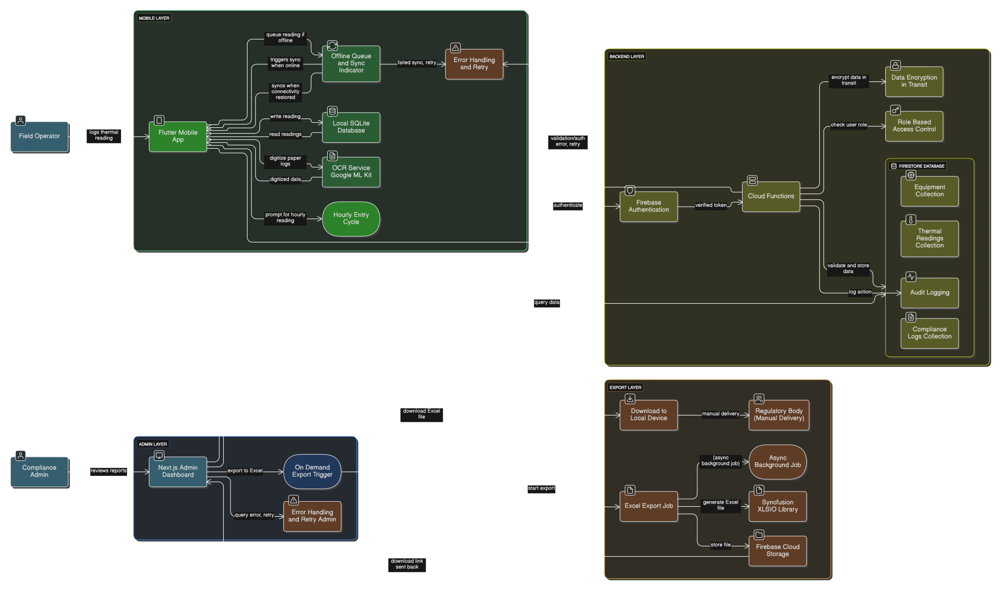
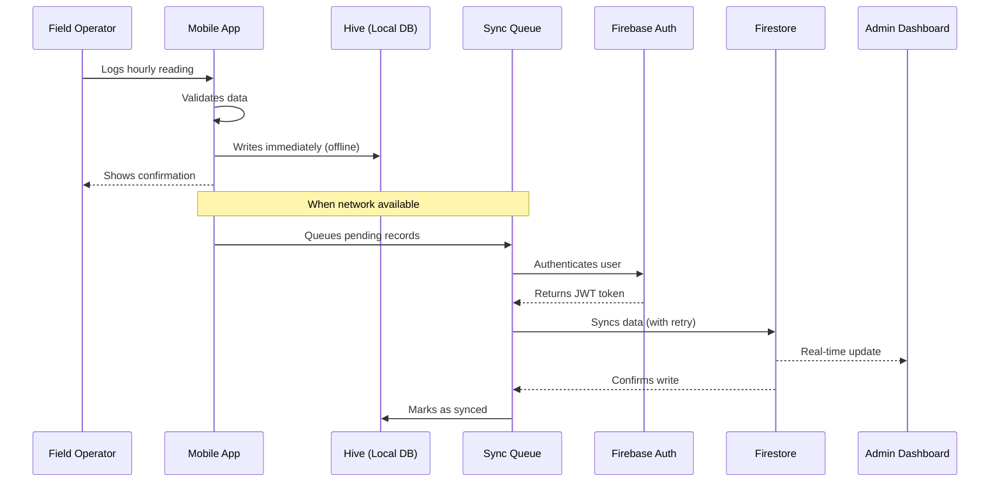
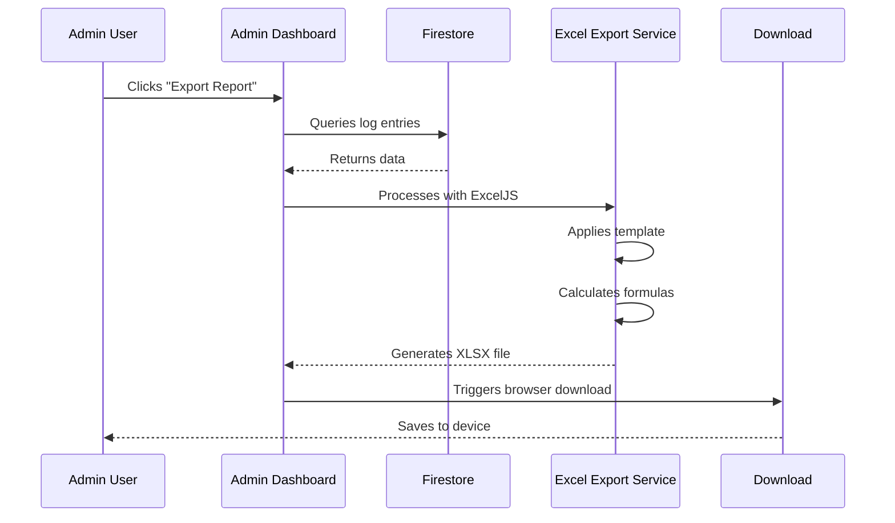
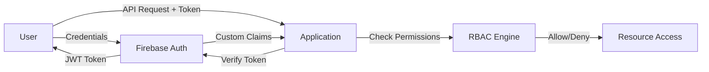

# System Architecture

**[← Back to Main README](../README.md)**

---

## 🔍 Interactive Diagram Viewer

**[🚀 View Live Interactive Diagram](https://htmlpreview.github.io/?https://github.com/MonteBryce/thermal-compliance-app/blob/main/docs/architecture-viewer.html)**

**Features:** Scroll to zoom • Click & drag to pan • Keyboard shortcuts (`+`/`-`/`F`/`0`)

No download required - opens directly in your browser with full pan/zoom controls

---

## System Integration Flow



### Viewing Options

- **Interactive HTML Viewer**: Download [architecture-viewer.html](architecture-viewer.html) and open in browser for pan/zoom controls
- **GitHub**: Right-click diagram → "Open image in new tab" → Use browser zoom (Ctrl/Cmd + scroll)
- **High-res Export**: Available in [docs/](.) folder

---

## 📖 Overview

The Thermal Compliance App is an **enterprise-grade, offline-first system** designed for industrial environmental compliance monitoring. The architecture follows a **modular monolith pattern** with clear separation of concerns across three primary layers:

1. **Mobile/Web Client** (Flutter) - Field data collection
2. **Admin Dashboard** (Next.js) - Management and reporting
3. **Cloud Backend** (Firebase) - Data synchronization and storage

### Architecture Philosophy

- **Offline-First**: Field operations must work without network connectivity
- **Real-Time Sync**: Changes propagate immediately when online
- **Separation of Concerns**: Mobile and Admin have distinct responsibilities
- **Managed Backend**: Firebase provides scalability and security
- **Testability**: Clear layers enable comprehensive testing

---

## 🏗️ High-Level Component Map

```
thermal-compliance-app/
├── 📱 Mobile Application (Flutter)
│   ├── Presentation Layer (Screens, Widgets)
│   ├── State Management (Riverpod Providers)
│   ├── Business Logic (Services)
│   ├── Data Layer (Firestore Client, Hive Local DB)
│   └── Features: Offline-first, OCR, Dynamic Forms
│
├── 🖥️ Admin Dashboard (Next.js)
│   ├── App Router (Pages, Layouts)
│   ├── Server Components (Data Fetching)
│   ├── Client Components (Interactivity)
│   ├── Firebase Admin SDK
│   └── Features: Template Builder, Excel Export, RBAC
│
└── ☁️ Firebase Backend
    ├── Firestore (Real-time Database)
    ├── Authentication (User Management)
    ├── Cloud Functions (Future: Server-side Processing)
    ├── Storage (Future: Image/File Storage)
    └── Security Rules (Access Control)
```

---

## 🔄 Data Flow Architecture

### Field Operations Flow



### Reporting Flow



---

## 🎯 Component Deep Dive

### Mobile Application Architecture

**[📱 View Detailed Mobile Architecture](../mobile-app/ARCHITECTURE.md)**

```
┌─────────────────────────────────────────┐
│         Presentation Layer              │
│  ┌─────────────┐      ┌──────────────┐ │
│  │  Screens    │◄────►│   Widgets    │ │
│  └─────────────┘      └──────────────┘ │
└──────────────┬──────────────────────────┘
               │
┌──────────────▼──────────────────────────┐
│       State Management Layer            │
│  ┌─────────────────────────────────┐   │
│  │    Riverpod Providers           │   │
│  │ (JobProvider, SyncProvider...)  │   │
│  └─────────────────────────────────┘   │
└──────────────┬──────────────────────────┘
               │
┌──────────────▼──────────────────────────┐
│        Business Logic Layer             │
│  ┌──────────┐ ┌────────────┐           │
│  │ Services │ │ Validators │           │
│  └──────────┘ └────────────┘           │
└──────────────┬──────────────────────────┘
               │
┌──────────────▼──────────────────────────┐
│          Data Layer                     │
│  ┌────────────┐    ┌─────────────────┐ │
│  │ Firestore  │    │  Hive Local DB  │ │
│  │  Client    │◄──►│  (Offline)      │ │
│  └────────────┘    └─────────────────┘ │
└─────────────────────────────────────────┘
```

**Key Features:**
- **Offline-First**: All operations work without network
- **Sync Engine**: Background synchronization with exponential backoff retry
- **OCR Integration**: Google ML Kit for paper log digitization
- **Dynamic Forms**: Job-specific data collection templates
- **State Management**: Riverpod for reactive, testable architecture

**Technology Stack:**
- Flutter 3.32.7, Dart 3.0+
- Riverpod (state management)
- Hive (local storage)
- Firebase SDK (sync)
- GoRouter (navigation)

---

### Admin Dashboard Architecture

**[🖥️ View Detailed Admin Architecture](../admin-dashboard/ARCHITECTURE.md)**

```
┌─────────────────────────────────────────┐
│       Next.js App Router                │
│  ┌─────────────────────────────────┐   │
│  │  Pages & Layouts (File-based)   │   │
│  └─────────────────────────────────┘   │
└──────────────┬──────────────────────────┘
               │
┌──────────────▼──────────────────────────┐
│      Component Layer (Hybrid)           │
│  ┌──────────────┐  ┌────────────────┐  │
│  │   Server     │  │    Client      │  │
│  │  Components  │  │  Components    │  │
│  │ (Data Fetch) │  │ (Interactive)  │  │
│  └──────────────┘  └────────────────┘  │
└──────────────┬──────────────────────────┘
               │
┌──────────────▼──────────────────────────┐
│        Services & Utils                 │
│  ┌─────────────┐ ┌──────────────────┐  │
│  │  Firebase   │ │  Excel Export    │  │
│  │ Admin SDK   │ │  (ExcelJS)       │  │
│  └─────────────┘ └──────────────────┘  │
└──────────────┬──────────────────────────┘
               │
┌──────────────▼──────────────────────────┐
│         Firebase Services               │
│  ┌─────────────────────────────────┐   │
│  │  Firestore │ Auth │ Storage      │   │
│  └─────────────────────────────────┘   │
└─────────────────────────────────────────┘
```

**Key Features:**
- **Server Components**: Efficient data fetching
- **Template Builder**: Drag-and-drop form designer
- **Excel Export**: Automated regulatory report generation
- **RBAC**: Role-based access control
- **Real-Time Queries**: Live Firestore subscriptions

**Technology Stack:**
- Next.js 15, React 19
- TypeScript 5.9
- Tailwind CSS + Radix UI
- Firebase Admin SDK
- ExcelJS (reports)

---

## 🔒 Security Architecture

### Authentication Flow



### Security Layers

1. **Authentication** (Firebase Auth)
   - Email/password authentication
   - JWT token-based sessions
   - Automatic token refresh
   - Secure token storage

2. **Authorization** (Custom Claims + Rules)
   - Role-based access control (Operator, Supervisor, Manager, Admin)
   - Custom claims stored in JWT
   - Firestore security rules enforce permissions
   - Field-level access control

3. **Data Protection**
   - HTTPS-only communication
   - Firestore encryption at rest
   - Hive local encryption (Flutter)
   - No sensitive data in logs

4. **Audit Logging**
   - All data modifications logged
   - Operator ID tracking
   - Timestamp recording
   - Change history preserved

### Firestore Security Rules (Simplified)

```javascript
rules_version = '2';
service cloud.firestore {
  match /databases/{database}/documents {

    // Helper functions
    function isAuthenticated() {
      return request.auth != null;
    }

    function hasRole(role) {
      return request.auth.token.role == role;
    }

    // Thermal readings - operators can create, admins can modify
    match /projects/{projectId}/logs/{logId}/entries/{entryId} {
      allow read: if isAuthenticated();
      allow create: if isAuthenticated() && hasRole('operator');
      allow update, delete: if hasRole('admin') || hasRole('manager');
    }

    // Users - only admins can manage
    match /users/{userId} {
      allow read: if isAuthenticated();
      allow write: if hasRole('admin');
    }
  }
}
```

---

## 📊 Data Synchronization Strategy

### Offline-First Implementation

**Core Principle**: User actions should never wait for network

```
User Action → Local Write (Hive) → UI Update (Immediate)
                    ↓
              Background Sync Queue
                    ↓
    (When Network Available) → Firestore Write
                    ↓
             Confirmation → Mark Local Record as Synced
```

### Sync Engine Architecture

```typescript
// Pseudocode for sync logic
class SyncEngine {
  async syncPendingRecords() {
    const pending = await hive.getPendingSyncRecords();

    for (const record of pending) {
      try {
        await firestoreClient.write(record);
        await hive.markAsSynced(record.id);
      } catch (error) {
        if (isRetryable(error)) {
          await scheduleRetry(record, exponentialBackoff);
        } else {
          await hive.markAsFailed(record.id, error);
        }
      }
    }
  }
}
```

### Conflict Resolution

**Strategy**: Last-Write-Wins (LWW) with timestamp

1. Each record has `createdAt` and `updatedAt` timestamps
2. On sync conflict, newest `updatedAt` wins
3. Optimistic UI updates (assume success)
4. Rollback on permanent failure

---

## 🚀 Scalability & Performance

### Current Capacity

| Metric | Target | Notes |
|--------|--------|-------|
| **Concurrent Users** | 10,000+ | Firebase auto-scales |
| **Firestore Documents** | 1M+ | No hard limit |
| **Mobile Local Storage** | 50MB/user | Hive database |
| **Sync Latency** | < 5s | Typical case |
| **Cold Start (Mobile)** | < 2s | Flutter optimized |
| **Dashboard Load Time** | < 1s | Next.js SSR |

### Performance Optimizations

**Mobile App:**
- Lazy loading for screens
- Pagination for large lists
- Image compression for OCR
- Debounced sync triggers
- Indexed Hive queries

**Admin Dashboard:**
- Server Components for data fetching
- Lazy imports for code splitting
- React.memo for expensive components
- Firestore query indexing
- LRU cache for Excel templates

### Scaling Strategies

**Horizontal Scaling:**
- Firebase handles backend scaling automatically
- Mobile apps are client-side (no server scaling needed)
- Admin dashboard can be deployed to multiple regions

**Future Enhancements:**
- Cloud Functions for heavy processing
- CDN for static assets
- Database sharding (if needed)
- Read replicas for reporting

---

## 🌐 Deployment Architecture

```
┌────────────────────────────────────────────────┐
│            Firebase Hosting (CDN)              │
├────────────────────────────────────────────────┤
│  Flutter Web App  │  Next.js Admin Dashboard  │
└────────────────────────────────────────────────┘
                      │
                      ▼
┌────────────────────────────────────────────────┐
│            Firebase Services                   │
├────────────────────────────────────────────────┤
│ Firestore │ Auth │ Functions │ Storage │ Rules│
└────────────────────────────────────────────────┘
                      │
                      ▼
┌────────────────────────────────────────────────┐
│           Mobile Clients                       │
├────────────────────────────────────────────────┤
│    iOS App    │  Android App  │  Web Browser  │
└────────────────────────────────────────────────┘
```

### Deployment Regions

- **Firebase**: Multi-region (nam5 - North America)
- **Cloud Functions**: us-central1 (planned)
- **Hosting**: Global CDN (Firebase)

### CI/CD Pipeline

```yaml
# .github/workflows/deploy.yml
name: Deploy

on:
  push:
    branches: [main]

jobs:
  test:
    runs-on: ubuntu-latest
    steps:
      - Flutter test
      - Admin dashboard test

  deploy:
    needs: test
    runs-on: ubuntu-latest
    steps:
      - Flutter web build
      - Next.js build
      - Firebase deploy
```

---

## 🔧 Technology Stack Rationale

| Decision | Technology | Why? |
|----------|-----------|------|
| **Mobile Framework** | Flutter | Single codebase for iOS, Android, Web. Hot reload for fast development. Native performance. |
| **State Management** | Riverpod | Type-safe, testable, no BuildContext dependency. Provider pattern familiar to team. |
| **Local Database** | Hive | Fast NoSQL storage. No native dependencies. Perfect for offline-first. |
| **Admin Framework** | Next.js | Server Components for performance. SEO-friendly. Excellent TypeScript support. |
| **UI Library** | Radix UI + Tailwind | Accessible primitives. Utility-first styling. Rapid development. |
| **Backend** | Firebase | Managed infrastructure. Real-time sync. Auto-scaling. Great DX. |
| **Excel Generation** | ExcelJS | Full Excel feature support. Runs in browser (no server needed). |
| **Authentication** | Firebase Auth | Battle-tested. JWT tokens. Custom claims for RBAC. |

---

## 🧪 Cross-Cutting Concerns

### Error Handling

**Mobile App:**
```dart
try {
  await syncService.sync();
} on NetworkException {
  // Queue for retry
} on AuthException {
  // Redirect to login
} catch (e) {
  // Log error, show user-friendly message
}
```

**Admin Dashboard:**
```typescript
try {
  await firestore.collection('logs').add(data);
} catch (error) {
  if (isPermissionError(error)) {
    showToast('Access denied');
  } else {
    logError(error);
    showToast('An error occurred');
  }
}
```

### Logging & Monitoring

- **Mobile**: Local logs synced to Firestore
- **Admin**: Server-side logging (console)
- **Future**: Firebase Analytics, Crashlytics

### Testing Strategy

**Mobile App:**
- Unit tests: Services, models, utils
- Widget tests: UI components
- Integration tests: Full user flows with Firebase Emulator

**Admin Dashboard:**
- Unit tests: Utilities, helpers
- Component tests: React Testing Library
- E2E tests: Planned (Playwright/Cypress)

---

## 📖 Getting Started for Developers

### Prerequisites

```bash
# Install Flutter
https://docs.flutter.dev/get-started/install

# Install Node.js (18+)
https://nodejs.org/

# Install Firebase CLI
npm install -g firebase-tools

# Clone repository
git clone https://github.com/MonteBryce/thermal-compliance-app.git
cd thermal-compliance-app
```

### Run Mobile App

```bash
# Install dependencies
flutter pub get

# Run on web
flutter run -d chrome

# Run tests
flutter test
```

### Run Admin Dashboard

```bash
cd admin-dashboard
npm install
npm run dev
# Opens at http://localhost:3000
```

### Firebase Emulator

```bash
# Start all emulators
firebase emulators:start

# Emulator UI: http://localhost:4000
```

**[⚙️ Full Setup Guide](../SETUP_INSTRUCTIONS.md)**

---

## 🗺️ Future Architecture Enhancements

### Planned (v1.2 - v2.0)

1. **Cloud Functions** - Server-side data processing and validation
2. **Cloud Storage** - Image uploads for OCR and documentation
3. **Multi-Tenant** - Separate data for each organization
4. **API Gateway** - RESTful API for third-party integrations
5. **Analytics** - User behavior tracking and performance monitoring
6. **Notifications** - Push notifications for critical alerts
7. **GraphQL** - Consider GraphQL layer over Firestore

### Long-Term Vision

- Microservices architecture (if needed)
- Event-driven architecture with message queues
- Machine learning for OCR improvement
- Predictive analytics for compliance trends
- Mobile-first web app (PWA)

---

## 📚 Related Documentation

### Platform-Specific

- **[📱 Mobile App Architecture](../mobile-app/ARCHITECTURE.md)** - Flutter deep dive
- **[🖥️ Admin Dashboard Architecture](../admin-dashboard/ARCHITECTURE.md)** - Next.js deep dive

### General

- **[📖 Main README](../README.md)** - Project overview
- **[⚙️ Setup Instructions](../SETUP_INSTRUCTIONS.md)** - Installation guide
- **[🤝 Contributing](contributing.md)** - Development guidelines
- **[📋 Wireframe Summary](../WIREFRAME_project_summary.md)** - Design mockups

---

## 📞 Architecture Questions?

For architecture discussions or technical questions:

- **Email**: [Bryceman0829@yahoo.com](mailto:Bryceman0829@yahoo.com)
- **GitHub Issues**: [Open an issue](https://github.com/MonteBryce/thermal-compliance-app/issues)

---

**[↑ Back to Top](#system-architecture)** | **[← Back to Main README](../README.md)**
